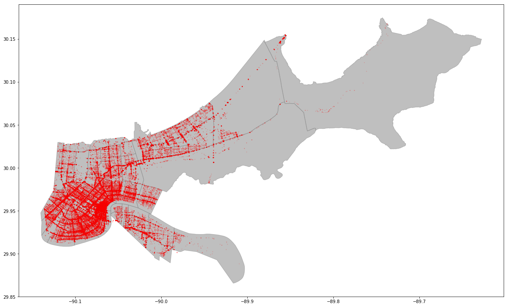
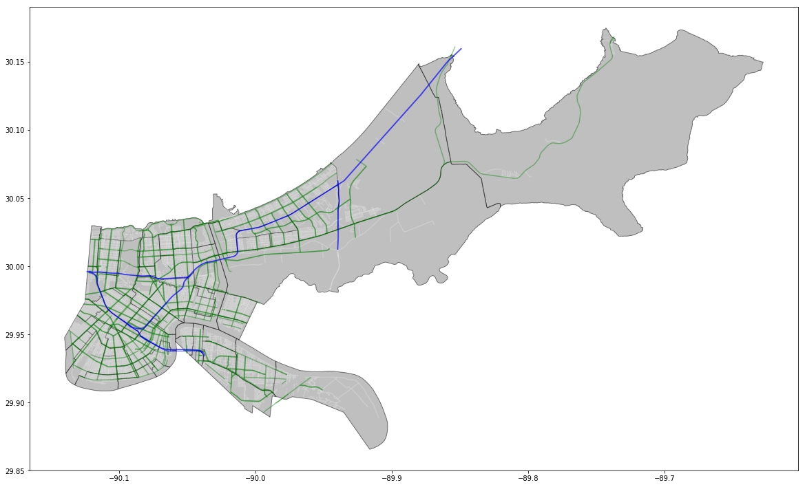
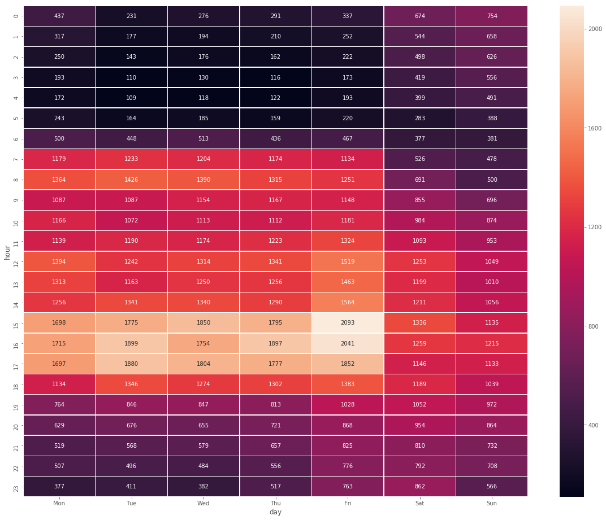
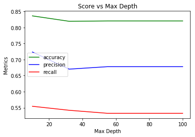
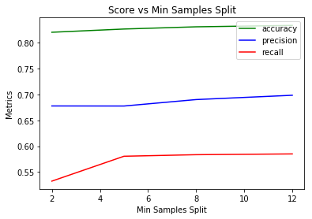
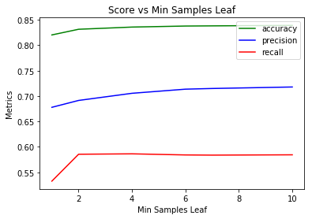
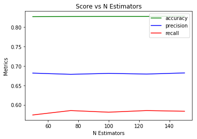

**New Orleans Traffic Accidents**

> An investigation of the causes of traffic accidents in New Orleans, LA.

**Contents**

- [Project Proposal](#project-proposal)
    - [The Problem](#the-problem)
    - [Potential Clients](#potential-clients)
    - [Data](#data)
    - [Problem Solving Approach](#problem-solving-approach)
    - [Deliverables](#deliverables)
- [Methods](#methods)
    - [Data Wrangling](#data-wrangling)
        - [Accidents](#accidents)
        - [Roads](#roads)
        - [Temporal Data](#temporal-data)
        - [Weather](#weather)
        - [Join Accidents to Roads](#join-accidents-to-roads)
        - [Compiled Features](#compiled-features)
- [Results](#results)
    - [Random Forest](#random-forest)
    - [Hyperparameter Tuning](#hyperparameter-tuning)
- [Conclusions](#conclusions)
- [Limitations](#limitations)
- [References](#references)
    - [Data](#data)

# Project Proposal

## The Problem

Traffic accidents are common, and can range from minor fender-benders to tragic events that leave people permanently disabled or killed. Even when accidents do not cause physical harm, the financial costs associated with repairing and replacing damaged property can be significant. In addition, there are public costs including emergency personnel and equipment, as well as additional delays and congestion caused by the accident. If the factors that cause traffic accidents could be identified and quantified, extra care could be taken by public institutions to warn drivers and pedestrians of increased dangers, at best preventing accidents before they happen, or at least lessening the impact of accidents on the immediate vicinity through more strategic deployment of first responders.

## Potential Clients

Local governments would be able to make use of a method for prediciting traffic accidents. Emergency services must deal with accidents daily in many jurisdictions, in addition to other situations which threaten life and property. Being able to better position personnel and supplies to deal with traffic accidents, or even implement communications campaigns to promote safety under particularly high-risk circumstances, would benefit the public as well as the specific individuals who are involved in any given accident.

## Data

I plan to use publicly available datasets, primarily from https://data.nola.gov, for this project. In particular, the [Calls for Service](https://data.nola.gov/Public-Safety-and-Preparedness/Calls-for-Service-2012/rv3g-ypg7) data, indicating all emergency response events in New Orleans, datasets will provide the basis for this analysis. Other relevant data from the City of New Orleans includes geospatial and other reference data on the streets of the city. In addition, I will include information on weather conditions such as temperature, precipitation, and wind-speed from [NOAA](https://www1.ncdc.noaa.gov/pub/data/cdo/) and datetime features such as daylight and holidays from https://www.timeanddate.com/.

In addition, an excellent [reference](http://urbcomp.ist.psu.edu/2017/papers/Predicting.pdf) for this analysis comes from a group of researchers who developed a state-wide model for predicting traffic accidents in Iowa.

## Problem Solving Approach

My goal will be to build a binary prediction model, classifying any given road segment and day/hour combination as either having an accident or being accident-free. I will combine the road information with the locations and times of accidents from the *Calls for Service* data, and then append weather and temporal features as appropriate. I plan to use a Random Forest Classifier model and, if time permits, a neural network.

## Deliverables

For this project, I will provide the code used to perform the data cleaning and analysis, as well as a slide deck providing a visual overview of the project and summarizing the findings and any recommendations for potential clients.

# Methods

I intially thought to add additional data related to other activities in the city (all also available on https://data.nola.gov, such as information from police reports, 311 calls, and Department of Public Works Roadwork Projects.

## Data Wrangling

My approach in data wrangling was to process each category of data separately and then merge them together according to time and location for my final dataset. The high-level steps I took are as follows:

1. Process accidents data
2. Process road data
3. Process time-based data
4. Process weather-based data
5. Join accidents to roads
6. Combine all previous steps into single dataset indexed by date/time and location

### Accidents

The call data included a 'type' field which classifies the nature of the call. In general, '100' refers to a hit and run while a '20' refers to a traffic accident. The letter codes indicate more specific things such as injuries, fatalities, and accidents involving city vehicles. The 'disposition' field refers to what first responders discovered upon arrival at the scene. 'NAT' means 'necessary action taken', 'RTF' means 'report to follow', while 'GOA' refers to 'gone on arrival'. When dealing with traffic accidents without injuries, it is not uncommon for responders to take a long time to arrive, so 'gone on arrival' is to be expected for some of these cases.

```python
target_types = ['100', '100C', '100F', '100I', '100X', '20', '20C', '20F', '20I', '20X']

target_dispositions = ['NAT', 'RTF', 'GOA']
```

Accident locations are designated both with a street address and latitute/longitute coordinate pairs. A map of accidents, plotted using lat/long coordinates with the geopandas `plot` function is shown below.

**Accident Locations**



### Roads

Road data was processed to result in two primary features (one continuous, the other categorical):

- Road Length
- Road Type ('Class')
    - Local (y/n)
    - Major Arterial (y/n)
    - Umimproved (y/n)
    - Ramp (y/n)
    - Freeway (y/n)
    - Other (y/n)

My goal was to find a reasonably-sized road segment as the unit of analysis. Making road segments too large would make predictions relatively meaningless, while too small might be difficult for the model. I ended up merging the road data with neighborhood data available from the city resulting in road segments that stretch the length of a single neighborhood, as defined by the City of New Orleans. To do this, I used the `dissolve` function from the `geopandas` python package. This is a method of aggregating spatial data based on some non-spatial feature. In this case, I used the neighborhood id field and 'dissolved' the boundaries between block-level roads within any given neighborhood, creating larger road segments that still were small enough to be useful for prediction and allocating emergency resources.

A map of New Orleans streets overlaid on the neighborhoods is shown below. Interstates are shown in blue, major streets are shown in green, and smaller local streets are shown in white.

**Road Types**



### Temporal Data

I constructed five features based on time:

- Date
- Hour
- Light (y/n)
- Holiday (y/n)
- Rush Hour (y/n)

In order to account for holidays celebrated regionally, I used timedelta offsets from Ash Wednesday, a nationally recognized holiday available in my time dataset, to calculate important dates around Mardi Gras parades.

```python
ash_wednesdays = holidays[holidays['holiday'] == 'Ash Wednesday']
mardi_gras = ash_wednesdays.date + pd.Timedelta('-1 day')
lundi_gras = ash_wednesdays.date + pd.Timedelta('-2 days')
mardi_gras_sunday = ash_wednesdays.date + pd.Timedelta('-3 days')
mardi_gras_saturday = ash_wednesdays.date + pd.Timedelta('-4 days')
mardi_gras_friday = ash_wednesdays.date + pd.Timedelta('-5 days')
mardi_gras_thursday = ash_wednesdays.date + pd.Timedelta('-6 days')
```

The heatmap shown below shows the distribution of accidents by day of week and hour of day. Some aspects to note from this map are the overall concentration of accidents during normal business hours on weekdays and the particularly high concentration on Friday afternoon during the evening rush hour. To a lesser extent, Friday and Saturday evenings also have a high concentration of accidents.

**Hour of Day**




### Weather

For weather data, the following variables were included:

- Temperature (degrees F)
- Wind Speed (mph)
- Precipitation Total (inches)

I examined two weather datasets, each from a different airport in the New Orleans area. While the Lakefront airport was more centrally located to most of New Orleans, there were significant gaps in the data, particularly temperature data, which made it difficult to interpolate missing values. I instead used data from the main New Orleans Airport which is west of the city itself. There were still a few missing data points, but it was much safer to interpolate those missing values because there were no gaps longer than a few hours.

The data included measurements taken at various times throughout the hour, so I resampled the data to a 1-hour time-series index.

```python
weather_airport_by_hour = weather_airport.resample('1h').max()

weather_airport_by_hour['precipitation'] = weather_airport_by_hour.precipitation.fillna(0)
weather_airport_by_hour['temp'] = weather_airport_by_hour.temp.interpolate()
weather_airport_by_hour['wind_speed'] = weather_airport_by_hour.wind_speed.interpolate()
```

### Join Accidents to Roads

I had several ideas about how to join the accident data with specific road segments. Once I decided to use neighborhood sized road segments, I decided that I would use the following process to assign each accident to a specific road segment:

**Spatially join accidents to neighborhoods**

```python
accidents_in_neighborhoods = gpd.sjoin(accidents, neighborhoods)
```

**Within each neighborhood, attempt to match each accident to a street segment based on the street names**

```python
accidents_join_street = pd.merge(accidents_in_neighborhoods,
                                 streets,
                                 left_on=['street_1', 'nhood_id'],
                                 right_on=['fullnameab', 'nhood_id'])
```

**For unmatched accidents, construct buffers of 50', 100', and 250'. Beginning with the 50' buffer, spatially join the 'buffered' accidents with street segments, keeping only matches which remain within a single neighborhood, proceeding to larger buffers as needed for unmatched accidents**

```python
spatial_join_50 = gpd.sjoin(buffer_50, streets_la_crs)
spatial_join_100 = gpd.sjoin(buffer_100, streets_la_crs)
spatial_join_250 = gpd.sjoin(buffer_250, streets_la_crs)

unmatched_items = unmatched_items[~unmatched_items.isin(nhood_match_50_unique.ItemNumber)]
```

**Concatenate all matches to a single data frame, and round off times of accidents to the hour for simplicity**

```python
dataframes = [street_match,
              nhood_match_50_unique,
              nhood_match_100_unique,
              nhood_match_250_unique]

street_by_time.columns = ['day_hour', 'segment_id', 'accident_yn']
```

### Compiled Features

**Goal: Dataset for all accidents that is indexed by ROAD SEGMENT and DATETIME**

I constructed ranges for the sample space of all eligible dates, times, and road segments for selection of negative samples (spaces/times *without* an accident). I then created a dataframe with 1,000,000 combinations of samples. I removed duplicates, and then removed any samples that were present in the accidents dataset, meaning it was a positive sample. I then chose three times the number of positive samples at random from this dataframe.

```python
np.random.seed(42)
sample_space_date = pd.Series(pd.date_range('2012-01-01', '2018-06-30')).dt.date
sample_space_hour = pd.Series([x for x in range(24)])
sample_space_location = street_info.segment_id.sort_values().reset_index(drop=True)

n_rows = 1000000
sample_dates = np.random.choice(sample_space_date, size=n_rows)
sample_hours = np.random.choice(sample_space_hour, size=n_rows)
sample_locations = np.random.choice(sample_space_location, size=n_rows)
```

My final dataset contained the following features, plus the accident outcome variable:

```python
renamed_cols = ['date',
                'hour',
                'segment_id',
                'daylight_yn',
                'holiday_yn',
                'rush_hour_yn',
                'temp',
                'wind_speed',
                'precipitation',
                'road_length',
                'class_freeway',
                'class_local',
                'class_major',
                'class_other',
                'class_unimproved',
                'accident_yn']
```

# Results

## Random Forest

I chose to use a Random Forest Classification model to predict whether or not any given street segment, during any given hour, would have an accident or not. I decided to use a binary outcome, rather than attempting to predict the number of accidents, to simplify the problem for this initial attempt.

I started with a basic model using 100 trees. After splitting the data into training and testing sets I trained the model and predicted results on the testing set. Looking at feature importance showed that by far the most impactful feature was road length. This may be cause for concern as it indicates that longer road segments are simply being predicted to have more accidents. Although further feature engineering and modification of the road segment length would be a useful next step, I proceeded to hyperparameter tuning in order to maximize the predictive power of the current model.

## Hyperparameter Tuning

I performed a Randomized Search Cross Validation algorithm to find the optimal values for the following hyperparameters of the Random Forest model: (1) Bootstrap sampling; (2) Maximum depth of tree; (3) Maximum number of features to consider when splitting; (4) Minimum number of samples for a leaf node; (5) Minimum samples required to split an internal node; and (6) Number of trees.

The parameters in the base model, the search range used in the randomized search, and the best parameters identified, are shown in the table below:

| Parameter         | Base Value | Search Range                  | Best     |
| ----------------- | ---------- | ----------------------------- | -------- |
| bootstrap         | `True`     | `[True, False]`               | `True`   |
| max_depth         | `None`     | `[10, 32, 55, 77, 100, None]` | `100`    |
| max_features      | `'auto'`   | `['auto', 'sqrt']`            | `'sqrt'` |
| min_samples_leaf  | `1`        | `[1, 2, 4]`                   | `4`      |
| min_samples_split | `2`        | `[2, 5, 10]`                  | `10`     |
| n_estimators      | `100`      | `[50, 75, 100, 125, 150]`     | `125`    |

Plots showing the change in model metrics (accuracy, precision, and recall) over the range of hyperparameters are shown below:

|         |  |
| -------------------------------------------- | --------------------------------------------- |
|  |       |

In all of these plots, it appears that model performance quickly plateaus, and not much improvement is made after initial changes to hyperparameters. However, through the process of hyperparameter tuning, each metric of model performance was improved, particularly precision. The results of model performance are shown in the table below.

**Model Performance**

| Metric    | Base Model | Best Model | Improvement |
| --------- | ---------- | ---------- | ----------- |
| Accuracy  | 82.85%     | 84.23%     | 1.66%       |
| Precision | 68.07%     | 72.33%     | 6.26%       |
| Recall    | 58.57%     | 59.33%     | 1.30%       |

As noted above, the most impactful feature was road length. Through hyperparameter tuning, two features related to road type significantly increased in relative importance, while weather related features significantly decreased.

**Feature Relative Importance**

| Feature          | Base Model | Best Model | Change     |
| ---------------- | ---------- | ---------- | ---------- |
| road_length      | 42.50%     | 40.25%     | -2.25%     |
| class_major      | 9.44%      | 15.39%     | **+5.95%** |
| class_local      | 6.13%      | 12.54%     | **+6.41%** |
| temp             | 15.62%     | 8.40%      | -7.22%     |
| hour             | 8.23%      | 7.71%      | -0.52%     |
| wind_speed       | 9.90%      | 5.80%      | -4.10%     |
| daylight_yn      | 1.20%      | 2.27%      | **+1.07%** |
| class_unimproved | 0.77%      | 1.58%      | **+0.81%** |
| class_freeway    | 1.07%      | 1.51%      | **+0.44%** |
| precipitation    | 1.37%      | 0.82%      | -0.55%     |

# Conclusions

Based on these results, it appears that relatively accurate predictions of where and when a traffic accident will occur can be made using data on the network of roads and, to a lesser extent, weather and time of day. For general planning purposes, these results can be used by city officials to develop plans to quickly direct emergency services to major roads, particularly during certain times of day such as the Friday evening rush hour. Further investigation into road data, such as examination of speed limits, might help to provide insight into what city government might be able to do to prevent accidents from occurring, rather than simply improving response times.

# Limitations

The greatest cause for concern in these results is the significantly large contribution of road segment length to the predictive power of the model. Given additional time, I would reorganize the road dataset into block-by-block segments which would all be roughly the same length, and re-run the same model. In addition, I would like to use a neural network model to predict accidents, utilizing more advanced spatial analysis. The methods used in the literature I searched while working on this project are more advanced than my current understanding, but I hope to utilize those techniques in the future to improve the prediction of traffic accidents using these data.

# References

## Data

- [Weather](https://www1.ncdc.noaa.gov/pub/data/cdo/documentation/LCD_documentation.pdf)
- [Calls for Service 2012](https://data.nola.gov/Public-Safety-and-Preparedness/Calls-for-Service-2012/rv3g-ypg7)
- [Calls for Service 2013](https://data.nola.gov/Public-Safety-and-Preparedness/Calls-for-Service-2013/5fn8-vtui)
- [Calls for Service 2014](https://data.nola.gov/Public-Safety-and-Preparedness/Calls-for-Service-2014/jsyu-nz5r)
- [Calls for Service 2015](https://data.nola.gov/Public-Safety-and-Preparedness/Calls-for-Service-2015/w68y-xmk6)
- [Calls for Service 2016](https://data.nola.gov/Public-Safety-and-Preparedness/Calls-for-Service-2016/wgrp-d3ma)
- [Calls for Service 2017](https://data.nola.gov/Public-Safety-and-Preparedness/Calls-for-Service-2017/bqmt-f3jk)
- [Calls for Service 2018](https://data.nola.gov/Public-Safety-and-Preparedness/Calls-for-Service-2018/9san-ivhk)
- [Neighborhoods](https://data.nola.gov/Geographic-Base-Layers/Neighborhood-Statistical-Areas/c2j2-5qdf)
- [Holiday and Date/Time](https://www.timeanddate.com/)
- [Roads](https://data.nola.gov/dataset/Road-Centerline/3wh2-z5dr)